# Pinnacle Financial Services -- Snowflake Integration Architecture

```mermaid
graph TB
    %% ───────────────────────────────────────
    %% Color classes
    %% ───────────────────────────────────────
    classDef existing fill:#9e9e9e,stroke:#616161,color:#fff
    classDef new fill:#4caf50,stroke:#2e7d32,color:#fff
    classDef snowflake fill:#29b5e8,stroke:#1a8ab5,color:#fff
    classDef schema fill:#e3f2fd,stroke:#29b5e8,color:#0d47a1
    classDef cortex fill:#1565c0,stroke:#0d47a1,color:#fff

    %% ───────────────────────────────────────
    %% DATA SOURCES
    %% ───────────────────────────────────────
    subgraph SOURCES ["DATA SOURCES (Existing Systems)"]
        direction TB
        GEN["Advent Geneva\nPortfolio Accounting\nPositions, NAV, AUM, Transactions"]:::existing
        NS["NetSuite\nGeneral Ledger\nGL Entries, AP/AR, Revenue, Expenses"]:::existing
        SF["Salesforce FSC\nCRM\nClient Accounts, AUM Tracking, Relationships"]:::existing
    end

    %% ───────────────────────────────────────
    %% INGESTION LAYER
    %% ───────────────────────────────────────
    subgraph INGESTION ["INGESTION LAYER (New)"]
        direction TB
        GEN_ING["Geneva Connector\nSFTP/API Extract\nScheduled Batch"]:::new
        NS_ING["NetSuite Connector\nSnowflake Connector for NetSuite\nAPI-Based"]:::new
        SF_ING["Salesforce Connector\nSnowflake Connector for Salesforce\nCDC-Enabled"]:::new
    end

    %% ───────────────────────────────────────
    %% SNOWFLAKE PLATFORM
    %% ───────────────────────────────────────
    subgraph SNOWFLAKE ["SNOWFLAKE PLATFORM"]
        direction TB

        subgraph SCHEMAS ["Data Architecture"]
            direction LR
            RAW["RAW Schema\n─────────────\nGeneva raw extracts\nNetSuite raw tables\nSalesforce raw objects\n─────────────\nAppend-only, immutable"]:::schema
            CURATED["CURATED Schema\n─────────────\nCleansed & conformed\nStar schema model\nDIM + FACT tables\n─────────────\nBusiness keys resolved"]:::schema
            ANALYTICS["ANALYTICS Schema\n─────────────\nSemantic View\nPre-built metrics\nP&L, profitability\n─────────────\nConsumption-ready"]:::schema
        end

        subgraph AI ["Cortex AI Layer (New)"]
            direction LR
            SV["Semantic View\nPINNACLE_FINANCIAL_SV\n395 properties"]:::cortex
            CA["Cortex Analyst\nText-to-SQL\nNL Query Engine"]:::cortex
            SI["Snowflake Intelligence\nChat Interface\nSelf-Service Analytics"]:::cortex
        end

        subgraph GOV ["Governance"]
            direction LR
            AUDIT["Audit Trail\nQuery History\nAccess Logging"]:::snowflake
            RBAC["RBAC\nRole-Based Access\nColumn Masking"]:::snowflake
            SOC["SOC 2\nCompliant Infrastructure\nEncryption at Rest/Transit"]:::snowflake
        end
    end

    %% ───────────────────────────────────────
    %% CONSUMPTION LAYER
    %% ───────────────────────────────────────
    subgraph CONSUMERS ["CONSUMPTION LAYER"]
        direction TB
        PBI["Power BI\nExisting Dashboards\nFinance Team"]:::existing
        SIC["Snowflake Intelligence\nNL Chat Interface\nExecutives & Analysts"]:::new
        API["REST API\nProgrammatic Access\nFuture Integration"]:::new
    end

    %% ───────────────────────────────────────
    %% DATA FLOW: Sources → Ingestion
    %% ───────────────────────────────────────
    GEN -->|"Batch SFTP\nDaily 6AM ET\n~15 min latency"| GEN_ING
    NS -->|"API Sync\nEvery 4 hours\n~30 min latency"| NS_ING
    SF -->|"CDC Stream\nNear real-time\n~5 min latency"| SF_ING

    %% ───────────────────────────────────────
    %% DATA FLOW: Ingestion → Snowflake RAW
    %% ───────────────────────────────────────
    GEN_ING -->|"Snowpipe\nAuto-ingest"| RAW
    NS_ING -->|"Snowpipe\nAuto-ingest"| RAW
    SF_ING -->|"Snowpipe\nAuto-ingest"| RAW

    %% ───────────────────────────────────────
    %% DATA FLOW: Within Snowflake
    %% ───────────────────────────────────────
    RAW -->|"Dynamic Tables\nIncremental refresh\n~10 min lag"| CURATED
    CURATED -->|"Dynamic Tables\nMetric rollups\n~5 min lag"| ANALYTICS
    ANALYTICS --> SV
    SV --> CA
    CA --> SI

    %% ───────────────────────────────────────
    %% DATA FLOW: Snowflake → Consumers
    %% ───────────────────────────────────────
    ANALYTICS -->|"Snowflake ODBC/JDBC\nDirect query\n< 1 sec"| PBI
    SI -->|"NL → SQL → Results\nReal-time\n< 5 sec"| SIC
    ANALYTICS -->|"Snowflake REST API\nOn-demand\n< 2 sec"| API

    %% ───────────────────────────────────────
    %% Governance connections
    %% ───────────────────────────────────────
    ANALYTICS -.-> GOV
```

## Legend

| Color | Meaning |
|-------|---------|
| **Gray** | Existing systems (Geneva, NetSuite, Salesforce, Power BI) |
| **Green** | New components introduced by Snowflake integration |
| **Blue** | Snowflake platform and Cortex AI layer |
| **Light blue** | Snowflake schema layers (RAW / CURATED / ANALYTICS) |

## Data Latency Summary

| Flow | Method | Frequency | End-to-End Latency |
|------|--------|-----------|-------------------|
| Geneva to RAW | SFTP extract + Snowpipe | Daily at 6 AM ET | ~15 minutes |
| NetSuite to RAW | Snowflake Connector API | Every 4 hours | ~30 minutes |
| Salesforce to RAW | CDC + Snowpipe | Near real-time | ~5 minutes |
| RAW to CURATED | Dynamic Tables (incremental) | Continuous | ~10 minutes |
| CURATED to ANALYTICS | Dynamic Tables (rollups) | Continuous | ~5 minutes |
| Analytics to Power BI | ODBC/JDBC direct query | On-demand | < 1 second |
| Snowflake Intelligence | NL to SQL via Cortex Analyst | Real-time | < 5 seconds |
| REST API | Snowflake SQL API | On-demand | < 2 seconds |

## Key Design Decisions

1. **Three-schema architecture** (RAW/CURATED/ANALYTICS) -- separates ingestion from transformation from consumption, enabling independent debugging and rollback
2. **Dynamic Tables** for RAW-to-CURATED-to-ANALYTICS -- incremental refresh replaces the manual reconciliation currently done by 3 FTEs
3. **Snowflake native connectors** for NetSuite and Salesforce -- eliminates the need for middleware ETL tools
4. **Geneva via SFTP** -- Geneva's export capabilities are batch-oriented; daily extract is standard for portfolio accounting
5. **Semantic View as single source of truth** -- 395-property model ensures consistent metric definitions across Power BI and Snowflake Intelligence
6. **Power BI retained** -- existing dashboards continue to work via Snowflake ODBC, no rip-and-replace required
