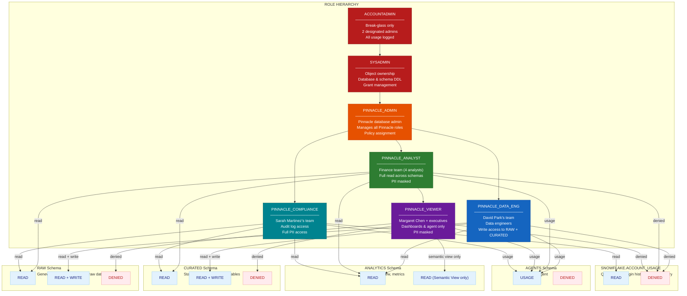

# Pinnacle Financial Services -- Role Hierarchy



## Role Descriptions

| Role | Assigned To | Purpose |
|---|---|---|
| `ACCOUNTADMIN` | 2 designated admins (break-glass) | Emergency access only. All usage triggers an alert. |
| `SYSADMIN` | Snowflake platform admin | Owns databases, schemas, warehouses. No direct data access. |
| `PINNACLE_ADMIN` | Pinnacle database administrator | Manages all Pinnacle-specific roles, policies, and grants. Parent of all functional roles. |
| `PINNACLE_DATA_ENG` | David Park's engineering team | Builds and maintains pipelines. Write access to RAW and CURATED. Creates Dynamic Tables, Snowpipes, connectors. |
| `PINNACLE_ANALYST` | Finance operations team (4 analysts) | Full read across RAW, CURATED, ANALYTICS. PII is masked. Runs ad-hoc queries and uses Cortex Agent. |
| `PINNACLE_VIEWER` | Margaret Chen + executives | Dashboard and Cortex Agent access only. Cannot query tables directly -- limited to Semantic View and Snowflake Intelligence. |
| `PINNACLE_COMPLIANCE` | Sarah Martinez's compliance team | Full read across all schemas plus SNOWFLAKE.ACCOUNT_USAGE for audit logs. Full PII access (unmasked) for regulatory reporting. |

## Access Matrix

| Capability | DATA_ENG | ANALYST | VIEWER | COMPLIANCE |
|---|---|---|---|---|
| **RAW Schema** | READ + WRITE | READ | -- | READ |
| **CURATED Schema** | READ + WRITE | READ | -- | READ |
| **ANALYTICS Schema** | READ | READ | Semantic View only | READ |
| **AGENTS Schema** | USAGE | USAGE | USAGE | USAGE |
| **Cortex Agent** | USAGE | USAGE | USAGE | USAGE |
| **Snowflake Intelligence** | Yes | Yes | Yes | Yes |
| **ACCOUNT_USAGE (audit)** | -- | -- | -- | READ |
| **DDL (CREATE/ALTER/DROP)** | RAW + CURATED | -- | -- | -- |
| **DML (INSERT/UPDATE/DELETE)** | RAW + CURATED | -- | -- | -- |

## Sensitive Column Access

| Column | DATA_ENG | ANALYST | VIEWER | COMPLIANCE |
|---|---|---|---|---|
| `CLIENT_NAME` | Full | Masked: `J*** D**` | Masked: `J*** D**` | Full |
| `TAX_ID / SSN` | Masked: `***-**-1234` | Masked: `***-**-1234` | Hidden | Full |
| `ACCOUNT_NUMBER` | Full | Masked: `****4567` | Hidden | Full |
| `EMAIL` | Full | Masked: `a***@***.com` | Hidden | Full |
| `PHONE` | Full | Masked: `***-***-5678` | Hidden | Full |
| `REVENUE_AMOUNT` | Full | Full | Via metric only | Full |
| `EXPENSE_AMOUNT` | Full | Full | Via metric only | Full |
| `AUM_AMOUNT` | Full | Full | Via metric only | Full |
| `FEE_BASIS_POINTS` | Full | Full | Hidden | Full |
| `VENDOR_NAME` | Full | Full | Hidden | Full |

## Implementation SQL

```sql
-- ──────────────────────────────────────────
-- 1. Create roles
-- ──────────────────────────────────────────
CREATE ROLE IF NOT EXISTS PINNACLE_ADMIN;
CREATE ROLE IF NOT EXISTS PINNACLE_DATA_ENG;
CREATE ROLE IF NOT EXISTS PINNACLE_ANALYST;
CREATE ROLE IF NOT EXISTS PINNACLE_VIEWER;
CREATE ROLE IF NOT EXISTS PINNACLE_COMPLIANCE;

-- ──────────────────────────────────────────
-- 2. Role hierarchy
-- ──────────────────────────────────────────
GRANT ROLE PINNACLE_ADMIN TO ROLE SYSADMIN;
GRANT ROLE PINNACLE_DATA_ENG TO ROLE PINNACLE_ADMIN;
GRANT ROLE PINNACLE_ANALYST TO ROLE PINNACLE_ADMIN;
GRANT ROLE PINNACLE_COMPLIANCE TO ROLE PINNACLE_ADMIN;
GRANT ROLE PINNACLE_VIEWER TO ROLE PINNACLE_ANALYST;

-- ──────────────────────────────────────────
-- 3. PINNACLE_DATA_ENG grants (read + write)
-- ──────────────────────────────────────────
GRANT USAGE ON DATABASE PINNACLE_FINANCIAL TO ROLE PINNACLE_DATA_ENG;
GRANT USAGE ON SCHEMA PINNACLE_FINANCIAL.RAW TO ROLE PINNACLE_DATA_ENG;
GRANT USAGE ON SCHEMA PINNACLE_FINANCIAL.CURATED TO ROLE PINNACLE_DATA_ENG;
GRANT USAGE ON SCHEMA PINNACLE_FINANCIAL.ANALYTICS TO ROLE PINNACLE_DATA_ENG;
GRANT USAGE ON SCHEMA PINNACLE_FINANCIAL.AGENTS TO ROLE PINNACLE_DATA_ENG;

-- RAW: read + write
GRANT SELECT, INSERT, UPDATE, DELETE ON ALL TABLES IN SCHEMA PINNACLE_FINANCIAL.RAW
  TO ROLE PINNACLE_DATA_ENG;
GRANT CREATE TABLE, CREATE PIPE, CREATE STREAM ON SCHEMA PINNACLE_FINANCIAL.RAW
  TO ROLE PINNACLE_DATA_ENG;

-- CURATED: read + write + create Dynamic Tables
GRANT SELECT, INSERT, UPDATE, DELETE ON ALL TABLES IN SCHEMA PINNACLE_FINANCIAL.CURATED
  TO ROLE PINNACLE_DATA_ENG;
GRANT CREATE TABLE, CREATE DYNAMIC TABLE ON SCHEMA PINNACLE_FINANCIAL.CURATED
  TO ROLE PINNACLE_DATA_ENG;

-- ANALYTICS: read
GRANT SELECT ON ALL TABLES IN SCHEMA PINNACLE_FINANCIAL.ANALYTICS TO ROLE PINNACLE_DATA_ENG;
GRANT SELECT ON ALL VIEWS IN SCHEMA PINNACLE_FINANCIAL.ANALYTICS TO ROLE PINNACLE_DATA_ENG;

-- AGENTS: usage
GRANT USAGE ON ALL AGENTS IN SCHEMA PINNACLE_FINANCIAL.AGENTS TO ROLE PINNACLE_DATA_ENG;

-- ──────────────────────────────────────────
-- 4. PINNACLE_ANALYST grants (read only)
-- ──────────────────────────────────────────
GRANT USAGE ON DATABASE PINNACLE_FINANCIAL TO ROLE PINNACLE_ANALYST;
GRANT USAGE ON SCHEMA PINNACLE_FINANCIAL.RAW TO ROLE PINNACLE_ANALYST;
GRANT USAGE ON SCHEMA PINNACLE_FINANCIAL.CURATED TO ROLE PINNACLE_ANALYST;
GRANT USAGE ON SCHEMA PINNACLE_FINANCIAL.ANALYTICS TO ROLE PINNACLE_ANALYST;
GRANT USAGE ON SCHEMA PINNACLE_FINANCIAL.AGENTS TO ROLE PINNACLE_ANALYST;

GRANT SELECT ON ALL TABLES IN SCHEMA PINNACLE_FINANCIAL.RAW TO ROLE PINNACLE_ANALYST;
GRANT SELECT ON ALL TABLES IN SCHEMA PINNACLE_FINANCIAL.CURATED TO ROLE PINNACLE_ANALYST;
GRANT SELECT ON ALL TABLES IN SCHEMA PINNACLE_FINANCIAL.ANALYTICS TO ROLE PINNACLE_ANALYST;
GRANT SELECT ON ALL VIEWS IN SCHEMA PINNACLE_FINANCIAL.ANALYTICS TO ROLE PINNACLE_ANALYST;
GRANT USAGE ON ALL AGENTS IN SCHEMA PINNACLE_FINANCIAL.AGENTS TO ROLE PINNACLE_ANALYST;

-- ──────────────────────────────────────────
-- 5. PINNACLE_VIEWER grants (analytics + agent only)
-- ──────────────────────────────────────────
GRANT USAGE ON DATABASE PINNACLE_FINANCIAL TO ROLE PINNACLE_VIEWER;
GRANT USAGE ON SCHEMA PINNACLE_FINANCIAL.ANALYTICS TO ROLE PINNACLE_VIEWER;
GRANT USAGE ON SCHEMA PINNACLE_FINANCIAL.AGENTS TO ROLE PINNACLE_VIEWER;

-- Semantic view only (no direct table access)
GRANT SELECT ON ALL VIEWS IN SCHEMA PINNACLE_FINANCIAL.ANALYTICS TO ROLE PINNACLE_VIEWER;
GRANT USAGE ON ALL AGENTS IN SCHEMA PINNACLE_FINANCIAL.AGENTS TO ROLE PINNACLE_VIEWER;
-- Note: no GRANT on RAW or CURATED schemas

-- ──────────────────────────────────────────
-- 6. PINNACLE_COMPLIANCE grants (full read + audit)
-- ──────────────────────────────────────────
GRANT USAGE ON DATABASE PINNACLE_FINANCIAL TO ROLE PINNACLE_COMPLIANCE;
GRANT USAGE ON SCHEMA PINNACLE_FINANCIAL.RAW TO ROLE PINNACLE_COMPLIANCE;
GRANT USAGE ON SCHEMA PINNACLE_FINANCIAL.CURATED TO ROLE PINNACLE_COMPLIANCE;
GRANT USAGE ON SCHEMA PINNACLE_FINANCIAL.ANALYTICS TO ROLE PINNACLE_COMPLIANCE;
GRANT USAGE ON SCHEMA PINNACLE_FINANCIAL.AGENTS TO ROLE PINNACLE_COMPLIANCE;

GRANT SELECT ON ALL TABLES IN SCHEMA PINNACLE_FINANCIAL.RAW TO ROLE PINNACLE_COMPLIANCE;
GRANT SELECT ON ALL TABLES IN SCHEMA PINNACLE_FINANCIAL.CURATED TO ROLE PINNACLE_COMPLIANCE;
GRANT SELECT ON ALL TABLES IN SCHEMA PINNACLE_FINANCIAL.ANALYTICS TO ROLE PINNACLE_COMPLIANCE;
GRANT SELECT ON ALL VIEWS IN SCHEMA PINNACLE_FINANCIAL.ANALYTICS TO ROLE PINNACLE_COMPLIANCE;
GRANT USAGE ON ALL AGENTS IN SCHEMA PINNACLE_FINANCIAL.AGENTS TO ROLE PINNACLE_COMPLIANCE;

-- Audit access (SNOWFLAKE database for ACCOUNT_USAGE views)
GRANT IMPORTED PRIVILEGES ON DATABASE SNOWFLAKE TO ROLE PINNACLE_COMPLIANCE;

-- ──────────────────────────────────────────
-- 7. Assign roles to users
-- ──────────────────────────────────────────
-- David Park's team
GRANT ROLE PINNACLE_DATA_ENG TO USER DAVID_PARK;
-- Also gets PINNACLE_ADMIN for managing other roles
GRANT ROLE PINNACLE_ADMIN TO USER DAVID_PARK;

-- Finance analysts
GRANT ROLE PINNACLE_ANALYST TO USER ANALYST_1;
GRANT ROLE PINNACLE_ANALYST TO USER ANALYST_2;
GRANT ROLE PINNACLE_ANALYST TO USER ANALYST_3;
GRANT ROLE PINNACLE_ANALYST TO USER ANALYST_4;

-- Executives
GRANT ROLE PINNACLE_VIEWER TO USER MARGARET_CHEN;

-- Compliance
GRANT ROLE PINNACLE_COMPLIANCE TO USER SARAH_MARTINEZ;

-- Service accounts (Power BI, API)
GRANT ROLE PINNACLE_VIEWER TO USER SVC_POWERBI;
GRANT ROLE PINNACLE_VIEWER TO USER SVC_API;

-- ──────────────────────────────────────────
-- 8. Future grants (auto-apply to new objects)
-- ──────────────────────────────────────────
GRANT SELECT ON FUTURE TABLES IN SCHEMA PINNACLE_FINANCIAL.RAW TO ROLE PINNACLE_DATA_ENG;
GRANT SELECT ON FUTURE TABLES IN SCHEMA PINNACLE_FINANCIAL.RAW TO ROLE PINNACLE_ANALYST;
GRANT SELECT ON FUTURE TABLES IN SCHEMA PINNACLE_FINANCIAL.RAW TO ROLE PINNACLE_COMPLIANCE;
GRANT SELECT ON FUTURE TABLES IN SCHEMA PINNACLE_FINANCIAL.CURATED TO ROLE PINNACLE_DATA_ENG;
GRANT SELECT ON FUTURE TABLES IN SCHEMA PINNACLE_FINANCIAL.CURATED TO ROLE PINNACLE_ANALYST;
GRANT SELECT ON FUTURE TABLES IN SCHEMA PINNACLE_FINANCIAL.CURATED TO ROLE PINNACLE_COMPLIANCE;
GRANT SELECT ON FUTURE VIEWS IN SCHEMA PINNACLE_FINANCIAL.ANALYTICS TO ROLE PINNACLE_VIEWER;
```
