# Pinnacle Financial Services -- Security Architecture

```mermaid
graph TB
    %% ───────────────────────────────────────
    %% Color classes
    %% ───────────────────────────────────────
    classDef idp fill:#9e9e9e,stroke:#616161,color:#fff
    classDef auth fill:#ff9800,stroke:#e65100,color:#fff
    classDef role fill:#1565c0,stroke:#0d47a1,color:#fff
    classDef mask fill:#e91e63,stroke:#880e4f,color:#fff
    classDef audit fill:#4caf50,stroke:#2e7d32,color:#fff
    classDef soc fill:#7c4dff,stroke:#4a148c,color:#fff
    classDef user fill:#e3f2fd,stroke:#29b5e8,color:#0d47a1

    %% ═══════════════════════════════════════
    %% 1. AUTHENTICATION FLOW
    %% ═══════════════════════════════════════
    subgraph AUTH_FLOW ["1. AUTHENTICATION FLOW"]
        direction LR

        subgraph USERS ["Users"]
            direction TB
            CFO["Margaret Chen\nCFO"]:::user
            VPOPS["David Park\nVP Operations"]:::user
            COMPLIANCE["Sarah Martinez\nHead of Compliance"]:::user
            ANALYSTS["Finance Analysts\n4 team members"]:::user
            SVC["Service Accounts\nPower BI, API"]:::user
        end

        subgraph SSO ["SSO Integration"]
            direction TB
            IDP["Corporate IdP\nAzure AD / Okta"]:::idp
            SAML["SAML 2.0\nFederated Auth"]:::auth
            MFA["MFA Enforced\nAll Human Users"]:::auth
            SCIM["SCIM Provisioning\nAutomated User Sync"]:::auth
            KEYPAIR["Key-Pair Auth\nService Accounts Only"]:::auth
        end

        subgraph SF_AUTH ["Snowflake Auth Layer"]
            direction TB
            NET_POL["Network Policy\n─────────────\nIP allowlist:\nNY, BOS, SF offices\nVPN CIDR blocks\n─────────────\nSOC 2: CC6.1"]:::soc
            SESSION["Session Policies\n─────────────\nIdle timeout: 30 min\nMax duration: 8 hrs\nNo client-side caching\n─────────────\nSOC 2: CC6.1"]:::soc
        end
    end

    CFO --> IDP
    VPOPS --> IDP
    COMPLIANCE --> IDP
    ANALYSTS --> IDP
    IDP --> SAML
    SAML --> MFA
    MFA --> NET_POL
    IDP --> SCIM
    SVC --> KEYPAIR
    KEYPAIR --> NET_POL
    NET_POL --> SESSION

    %% ═══════════════════════════════════════
    %% 2. ROLE HIERARCHY
    %% ═══════════════════════════════════════
    subgraph ROLE_HIER ["2. ROLE HIERARCHY (RBAC)"]
        direction TB

        ACCTADMIN["ACCOUNTADMIN\n─────────────\nBreak-glass only\nNo daily use\n─────────────\nSOC 2: CC6.3"]:::soc

        SECADMIN["SECURITYADMIN\n─────────────\nRole & grant mgmt\nPolicy assignment\n─────────────\nSOC 2: CC6.2"]:::soc

        SYSADMIN["SYSADMIN\n─────────────\nDatabase & schema\nobject ownership"]:::role

        subgraph FUNC_ROLES ["Functional Roles"]
            direction LR
            R_EXEC["PINNACLE_EXECUTIVE_RL\n─────────────\nMargaret Chen\n─────────────\nSemantic View: READ\nAgent: USAGE\nAnalytics schema: READ\nPII: MASKED"]:::role
            R_OPS["PINNACLE_OPS_RL\n─────────────\nDavid Park\n─────────────\nAll schemas: READ\nAgent: USAGE\nPII: FULL ACCESS\nQuery history: READ"]:::role
            R_COMP["PINNACLE_COMPLIANCE_RL\n─────────────\nSarah Martinez\n─────────────\nAll schemas: READ\nAudit logs: READ\nPII: FULL ACCESS\nAccess history: READ"]:::role
            R_ANALYST["PINNACLE_ANALYST_RL\n─────────────\nFinance Team (4)\n─────────────\nCurated + Analytics: READ\nAgent: USAGE\nPII: MASKED\nRAW: NO ACCESS"]:::role
        end

        SVC_RL["PINNACLE_SERVICE_RL\n─────────────\nPower BI, API\n─────────────\nAnalytics: READ\nPII: MASKED\nNo DDL privileges"]:::role
    end

    ACCTADMIN --> SECADMIN
    SECADMIN --> SYSADMIN
    SYSADMIN --> R_OPS
    SYSADMIN --> R_COMP
    R_OPS --> R_EXEC
    R_OPS --> R_ANALYST
    R_ANALYST --> SVC_RL

    %% ═══════════════════════════════════════
    %% 3. DATA MASKING
    %% ═══════════════════════════════════════
    subgraph MASKING ["3. DATA MASKING POLICIES"]
        direction TB

        subgraph PII_DATA ["PII Fields Protected"]
            direction LR
            PII_NAME["CLIENT_NAME\n─────────────\nFull: Ops, Compliance\nMasked: J*** D**\nExec, Analyst, Service"]:::mask
            PII_SSN["TAX_ID / SSN\n─────────────\nFull: Compliance only\nMasked: ***-**-1234\nAll other roles"]:::mask
            PII_ACCT["ACCOUNT_NUMBER\n─────────────\nFull: Ops, Compliance\nMasked: ****4567\nExec, Analyst, Service"]:::mask
            PII_CONTACT["EMAIL / PHONE\n─────────────\nFull: Ops, Compliance\nMasked: a***@***.com\nExec, Analyst, Service"]:::mask
        end

        subgraph POLICY_DEF ["Policy Implementation"]
            direction TB
            TAG_POL["Tag-Based Masking\n─────────────\nSNOWFLAKE.CORE.PRIVACY_CATEGORY\nauto-applied via classification\n─────────────\nSOC 2: CC6.5"]:::soc
            COL_POL["Column-Level Policies\n─────────────\nCREATE MASKING POLICY\nConditional on\nCURRENT_ROLE()\n─────────────\nSOC 2: CC6.5"]:::soc
            ROW_POL["Row Access Policy\n─────────────\nAdvisors see own clients\nManagers see office clients\nExecs see all\n─────────────\nSOC 2: CC6.5"]:::soc
        end
    end

    TAG_POL --> PII_NAME
    TAG_POL --> PII_SSN
    COL_POL --> PII_ACCT
    COL_POL --> PII_CONTACT
    ROW_POL --> PII_NAME

    %% ═══════════════════════════════════════
    %% 4. AUDIT LOGGING
    %% ═══════════════════════════════════════
    subgraph AUDIT_SYS ["4. AUDIT LOGGING"]
        direction TB

        subgraph AUDIT_SOURCES ["Audit Event Sources"]
            direction LR
            A_LOGIN["LOGIN_HISTORY\n─────────────\nAll auth attempts\nSuccess + failure\nIP, client, timestamp\n─────────────\nSOC 2: CC7.2"]:::audit
            A_QUERY["QUERY_HISTORY\n─────────────\nEvery SQL executed\nUser, role, warehouse\nDuration, rows scanned\n─────────────\nSOC 2: CC7.2"]:::audit
            A_ACCESS["ACCESS_HISTORY\n─────────────\nTable/column reads\nWho accessed what, when\nColumn-level lineage\n─────────────\nSOC 2: CC7.2"]:::audit
            A_GRANTS["GRANTS_TO_ROLES\n─────────────\nPermission changes\nRole assignments\nPolicy modifications\n─────────────\nSOC 2: CC6.2"]:::audit
        end

        subgraph RETENTION ["Retention & Monitoring"]
            direction LR
            RET["ACCOUNT_USAGE\n─────────────\n365-day retention\nAll audit views\nImmutable by users"]:::audit
            ALERT["Alerts & Notifications\n─────────────\nFailed login spikes\nPrivilege escalation\nOff-hours access\nBulk data export"]:::audit
            REPORT["Compliance Reports\n─────────────\nQuarterly access review\nSEC audit packages\nSOC 2 evidence\nADV/13F support"]:::audit
        end
    end

    A_LOGIN --> RET
    A_QUERY --> RET
    A_ACCESS --> RET
    A_GRANTS --> RET
    RET --> ALERT
    RET --> REPORT
```

## Legend

| Color | Meaning |
|-------|---------|
| **Gray** | Existing identity provider (Azure AD / Okta) |
| **Orange** | Authentication mechanisms (SAML, MFA, SCIM, Key-Pair) |
| **Blue** | Snowflake functional roles |
| **Pink** | PII data fields with masking policies |
| **Green** | Audit logging and monitoring |
| **Purple** | SOC 2 compliance touchpoints (labeled with control IDs) |
| **Light blue** | Users / stakeholders |

## SOC 2 Compliance Mapping

| SOC 2 Control | Category | Snowflake Implementation |
|---------------|----------|--------------------------|
| **CC6.1** | Logical Access | Network policies (IP allowlist), session policies (idle timeout, max duration), MFA enforcement |
| **CC6.2** | Access Provisioning | SCIM auto-provisioning from IdP, SECURITYADMIN manages grants, GRANTS_TO_ROLES audit trail |
| **CC6.3** | Privileged Access | ACCOUNTADMIN restricted to break-glass, no daily use, all usage logged |
| **CC6.5** | Data Protection | Tag-based masking for PII, column-level masking policies, row access policies per role |
| **CC7.1** | Change Detection | Dynamic Tables produce immutable lineage, schema changes tracked in ACCOUNT_USAGE |
| **CC7.2** | Security Monitoring | LOGIN_HISTORY, QUERY_HISTORY, ACCESS_HISTORY -- 365-day retention, alerting on anomalies |
| **CC8.1** | Incident Response | Failed login alerts, privilege escalation alerts, bulk export detection |

## Role-to-Data Access Matrix

| Schema / Object | EXECUTIVE | OPS | COMPLIANCE | ANALYST | SERVICE |
|---|---|---|---|---|---|
| RAW schema | -- | READ | READ | -- | -- |
| CURATED schema | -- | READ | READ | READ | -- |
| ANALYTICS schema | READ | READ | READ | READ | READ |
| Semantic View | READ | READ | READ | READ | READ |
| Cortex Agent | USAGE | USAGE | USAGE | USAGE | -- |
| Client PII | MASKED | FULL | FULL | MASKED | MASKED |
| Audit / Access History | -- | -- | READ | -- | -- |
| Query History | -- | READ | READ | -- | -- |
